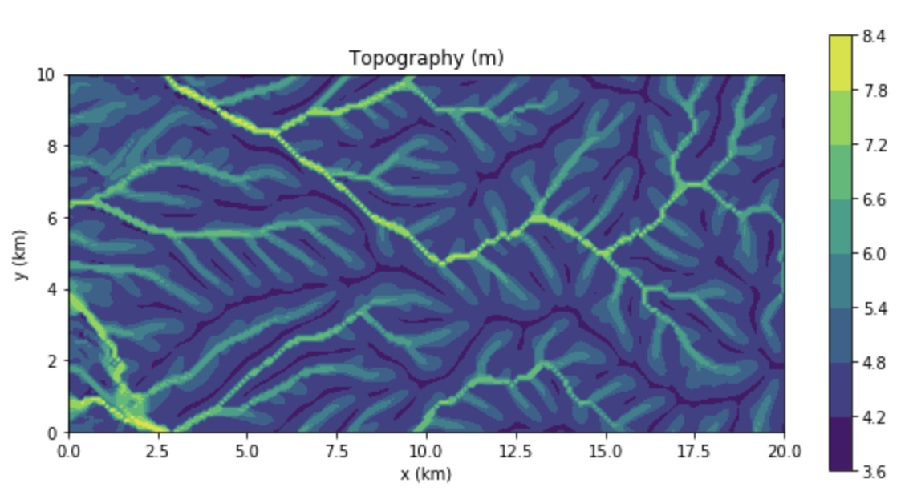

[#examples]
== Examples

Several examples are provided in the `examples` directory. They are meant to be used as templates by the user. To compile them, use the CMake option `-DBUILD_EXAMPLES=ON` (see <<install>> section for more details). This creates executables in the `examples` subfolder of your build directory. To run one of those examples, e.g., `Mountain`:

----
rm VTK/*.vtk
./Mountain
----

The first line is needed to remove any pre-existing `.vtk` file in the `VTK` directory.

=== Mountain.f90

This is the basic square mountain problem where a landscape is formed by a uniform uplift, all four boundaries being kept at base level. The resolution is medium (400x400). The SPL is non linear (n = 1.5) but no sediment effect is included (g = 0). Single direction flow is selected by setting `expp = 20`. The model run lasts for 10 Myr (100 time steps of 100 kyr each).

This model should run in approximately 60-70 seconds on a reasonably fast modern computer.

=== Fan.f90

Example of the use of the continental transport/deposition component of **FastScapeLib**.

Here we create a sedimentary fan at the base of an initially 1000 m high plateau. The model is relatively small (10x20 km) and low resolution (101x201). The erosion law is linear (n = 1) but sediments are more easily eroded (by a factor 1.5). Sediment transport/deposition is strong (g = 1). Multiple direction flow is selected. Boundary conditions are no flux boundaries except along the bottom boundary where base level is fixed at sea level (0 m).

This model should run in approximately 10 seconds on a reasonably fast modern computer.

=== DippingDyke.f90

Example of the use of spatially and temporally variable erodibility

Here we look at the effect of a resistant dyke dipping at 30 degree angle and being progressively exhumed. The dyke's surface expression progressively traverses the landscape and affects the drainage pattern.

The model, otherwise, is very simple: block uplift, all boundaries at base level, linear SPL, multiple direction flow and no sediment.

=== flexure_test.f90

This example shows how to use `flexure` but also how it interacts with **FastScapeLib**: it needs the topography computed by **FastScapeLib** as input to `flexure` but also needs to set the topography and basement geometry to the new values estimated by `flexure`.

=== FastScape_test.ipynb

This Jupyter notebook contains a simple (low resolution) example where the right-hand side of a rectangular model is an initially 100 m high plateau subjected to erosion, while the left-hand side is kept fixed at base level. The SPL is linear (`n = 1`) but completed by a sediment transport/deposition algoithm with `g = 1`.

Boundary conditions are closed except for the left hand-side (bounday number 4) set to base level.

The model is run for 200 time steps and the results are stored in `.vtk` files where the drainage area is also stored.

The drainage area of the last time step is also shown as a contour plot as shown in Figure <<#img-FastScapePyhton>>

[#img-FastScapePyhton]
.Fan example.

